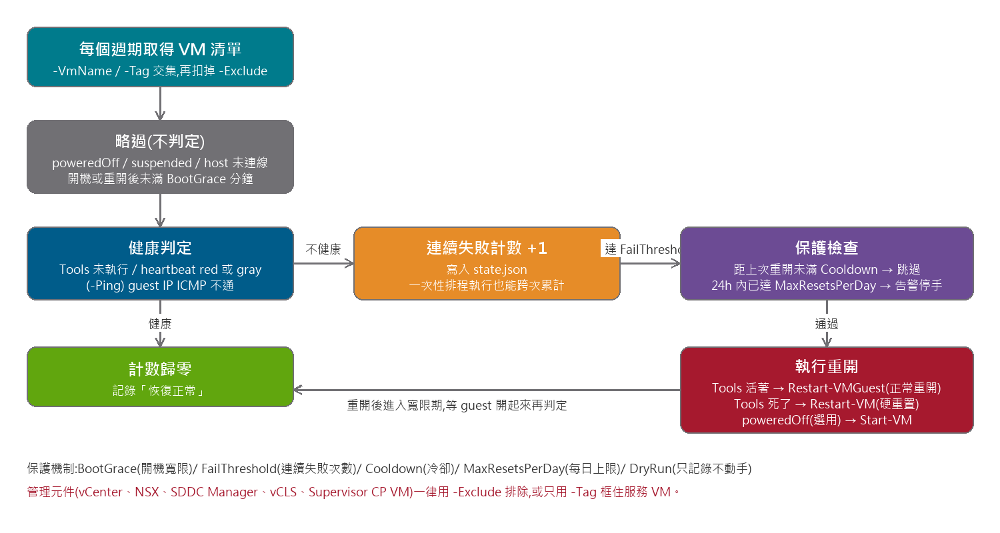

# Watch-VMHealth — vCenter 服務 VM 自動重開

監看 vCenter 裡指定範圍的 VM,guest 當機沒回應、或重開後卡在開機畫面起不來,
**連續多次確認後自動重開**;內建寬限期 / 冷卻 / 每日上限,避免誤判與無限重開迴圈。
只針對服務(工作負載)VM,vCenter / NSX / SDDC Manager 等管理元件一律排除。
PowerShell 7 + VMware.PowerCLI 13.x,`pwsh` 執行。



## 判定與動作

| 情況 | 判定依據 | 動作 |
|---|---|---|
| Guest 當機沒回應 | Tools 已安裝但 `ToolsRunningStatus ≠ guestToolsRunning` | `Restart-VM`(硬重置) |
| Tools 在跑但 guest 卡住 | `GuestHeartbeatStatus` = red / gray | `Restart-VM`(硬重置) |
| 重開後卡在開機畫面 | 開機超過 `-BootGraceMinutes` 仍無 Tools | `Restart-VM`(硬重置) |
| 網路不通(`-Ping`) | guest IP ICMP 不通 | Tools 活著 → `Restart-VMGuest`(正常重開) |
| 意外關機(`-PowerOnIfOff`,預設關) | poweredOff | `Start-VM` |

一律略過:suspended、主機未連線、沒 Tools 也沒 ping 目標、開機 / 重開後寬限期內。

## 保護機制

| 參數 | 預設 | 目的 |
|---|---|---|
| `-FailThreshold` | 3 | 連續幾次不健康才動手(單次抖動不觸發) |
| `-BootGraceMinutes` | 10 | 開機 / 重開後這段時間不判定 |
| `-CooldownMinutes` | 30 | 同一台重開後多久內不再重開 |
| `-MaxResetsPerDay` | 3 | 24h 內超過就停手記 ERROR,交人工 |
| `-DryRun` | — | 只記錄「本來會做什麼」,不執行 |
| `-Exclude` | `vCLS*`, `SupervisorControlPlaneVM*` | 管理元件永遠不在範圍內 |

連續失敗計數與重開紀錄存在 `watch-vmhealth.state.json`,所以 **Windows 排程每 5 分鐘跑一次也能跨次累計**,不一定要常駐。

## 用法

```powershell
# 先 DryRun 觀察幾天
pwsh .\Watch-VMHealth.ps1 -Server vc01.example.com -Credential (Get-Credential) `
     -VmName 'app-*','web-*' -Exclude 'vcf-*','vCLS*' -Ping -Loop -IntervalSeconds 60 -DryRun

# 用 vSphere Tag 框範圍(建議):貼了 AutoRestart 標籤的 VM 才納管
pwsh .\Watch-VMHealth.ps1 -Server vc01.example.com -Credential $cred -Tag AutoRestart -Ping -Loop

# 沒裝 Tools 的 VM 用 ping 判定
pwsh .\Watch-VMHealth.ps1 -Server vc01.example.com -Credential $cred -VmName legacy01 -Ping -PingMap @{ legacy01 = '10.10.1.50' }
```

排程用的憑證:`Get-Credential | Export-Clixml vc.cred`(同使用者、同機器才解得開),執行時 `-Credential (Import-Clixml vc.cred)`。

vCenter 帳號最小權限:目標 VM 的 Virtual machine → Interaction → Power On / Power Off / Reset,其餘唯讀。

## 實測(VCF 9.1)

在 guest 內 `echo c > /proc/sysrq-trigger` 觸發 kernel panic:
首次偵測 → 3 次確認(40 秒)→ 硬重置 → 寬限 3 分鐘 → 恢復正常;
vCenter 事件獨立查核,管理元件零 reset。完整過程與截圖見 `docs/`:

- `docs/Watch-VMHealth-使用手冊與實測報告.docx`
- `docs/Watch-VMHealth-服務VM自動重開工具.pptx`

實測抓到的兩個坑(已處理 / 已寫進文件):

1. `Restart-VM` 硬重置**不會更新** vCenter 的 `Runtime.BootTime` → 寬限期改以 BootTime 與腳本自己的上次重開時間較晚者起算。
2. Guest 防火牆擋 ICMP(Photon 預設 iptables DROP)會讓 `-Ping` 誤判 → 用 `-Ping` 前先確認放行。

## 注意

- 硬重置等同斷電;資料庫類 VM 建議拉高 `-FailThreshold`。
- 被 VMware Cloud Director 等系統接管的 VM,vCenter 會回 `The method is disabled by …`,腳本記 ERROR 跳過。
- 一個 vCenter 跑一個實例,狀態檔不支援多實例共用。
